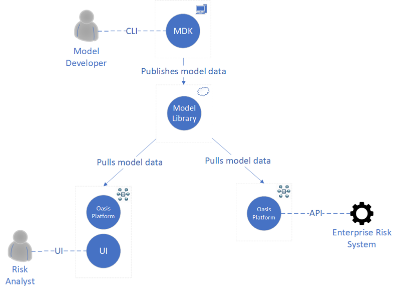

# Oasis Workshop 2019

## Overview
### Model data

The model data used in the exercises is an adapted version of a GEM hazard model for the Dominican Republic. This is based in work by Sunstone Risk, further details o which can be found [here](http://www.sunstonerisk.com/gem/). In the full implementation different intensity measures are used depending on the risk, but in the workshop version we have a simplified version using PGA only.

### Oasis ecosystem

The Oasis ecosystem has four main components.

1. Oasis Platform - Data standards, an API, tools and components for building and running catastrophe models. 

2. Oasis User Interface - Web based application for uploading exposure, running models deployed in Oasis, and retrieving results (via the MDK). 

3. Oasis Model Development Kit - Command line toolkit and reusable libraries for building, calibrating and creating the deployment assets for Oasis-ready models. It can also be used independently to run Oasis models end-to-end locally, or remotely via the Oasis API.

4. Oasis Model Library - Hosted catalogue for Oasis-ready models.

The ecosystem is shown in the diagram below.



These exercises in this workshop will illustrate how the components of the ecosystem fit together, and how different components can be used together at different points of model development, deployment and execution.

## Setting up the environment

### Local install (Linux + Mac OS X)

#### System libraries and dependencies

The pre-requisites for the system on an Ubuntu based system are listed in apt.txt. These can be installed by running the following command. Note that this is not required if your environment has been provided as part of an Oasis workshop.

```
cat apt.txt | xargs sudo apt-get install -y
```

If using another distribution then the comparable packages will need to be identified and installed, or alternatively use a Docker image. If using Mac OS X (10.10 or later) the best approach is to first install the <a href="https://brew.sh/" target="_blank">Homebrew</a> package manager, and use Homebrew to install the system libraries and dependencies (including Python 3), followed by `pip` (or `pip3`) to install the workshop specific Python requirements.

To install Homebrew you can run this Ruby command in Terminal

```
/usr/bin/ruby -e "$(curl -fsSL https://raw.githubusercontent.com/Homebrew/install/master/install)"

```

Then update and upgrade Homebrew using

```
brew update && brew upgrade
```

Then install the system libraries and dependencies using

```
cat brew.txt | xargs brew install

```

(You may find that this step requires some manual interaction or installations, Python 3 should get installed as part of this step, including `pip`). Once this is complete you can create the Python virtual env. and install the Python libraries in the virtual env. in the normal way using `pip install -r`, as described in the next section.

#### Python libraries

We recommend using a Python virtual environment for running the exercises. To set up the your virtual environment, run the following commands in the project root directory. Note that Python 3.6 is required for the Oasis MDK.

```
virtualenv -p /usr/bin/python3.6 venv
source venv/bin/activate
pip install -r requirements.txt
pip install ipykernel
ipython kernel install --user --name=OasisWorkshop2018
```

The full model data also needs to be created from smaller files, that are compatible with Git file size restrictions:

```
cat gem/model_data/GMO/footprint_data/* > gem/model_data/GMO/footprint.csv
```

Jupyter, which is used for the first two exercises, can be launched by running the following command within the virtualenv:

```
jupyter notebook  --NotebookApp.token='' --NotebookApp.password='' --no-browser --port=8888 --ip=0.0.0.0 --NotebookApp.base_url=/jupyter --allow-root
```
### Local install (Windows 10)

To run the Oasis workshop on Windows, WSL is needed. A guide to setting up WSL:
https://docs.microsoft.com/en-us/windows/wsl/install-win10

Then the Docker has to be installed and configured to work with WSL. See following:
https://nickjanetakis.com/blog/setting-up-docker-for-windows-and-wsl-to-work-flawlessly

In the directory of the workshop Docker image for the workshop needs to be created:
```
docker build -f Dockerfile.jupyter -t oasis_jupyter .
```

The full model data also needs to be created from smaller files, that are compatible with Git file size restrictions:

```
cat gem/model_data/GMO/footprint_data/* > gem/model_data/GMO/footprint.csv
```

The docker-compose_win.yml file has to be updated with the directory of the workshop:
```
echo "      - "$(pwd)":/Notebook/" >> gem/docker-compose_win.yml
```


The notebooks and the API now can be launched together:

```
cd gem
docker-compose -f docker-compose.oasis_ui.yml -f docker-compose_win.yml up -d
docker ps -a
```


## Exercises

#### Running the exercises
The first two exercises are provided either as interactive Jupyter notebooks. Jupyter is an open-source web application that allows you to create and share documents that contain live code, equations, visualizations and narrative text. The other exercises will be ran directly from the Linux shell.

#### Exercise 1: Exposure data in OED and the Oasis FM.
In this exercise you will create and validate some exposure in OED format. For the exercise details, go to the exercise_1 Jupyter notebook.

The notebooks can be accessed via: http://localhost:8888
##### Exercise goals:
- Understand the basic structure of the OED format.
- Use Python code to create exposure data.
- Use the Oasis MDK to run deterministic analyses for direct and reinsurance contracts.

#### Exercise 2: Running a model in the Oasis MDK.
In this exercise you will look at the various files that constitute an Oasis model, then run an analysis using the MDK. For the exercise details, go to the exercise_2 Jupyter notebook.
##### Exercise goals:
- Understand the Oasis model files.
- Use Python code to view the model files for an example model.
- Use the Oasis MDK to create exposure and run deterministic analyses for direct and reinsurance contracts.

#### Exercise 3: Running a model in the Oasis API.
In this exercise you will run an analysis using the Oasis API.
#### Linux
First, we need to start the API by running the following commands:
```
cd gem
docker-compose up -d
docker ps -a
```
#### Windows
The API was already started in the setup. The IP of the API can be obtained with following command:
```
docker inspect -f '{{range .NetworkSettings.Networks}}{{.IPAddress}}{{end}}' gem_server_1
```
The URL of API for exercise 3 is:    http://"insert your API IP":8888

For the exercise details, go to the exercise_3 Jupyter notebook.
##### Exercise goals:
- Understand the Oasis API.
- Use Python code to run an analysis via the API.

#### Exercise 4: Running a model in the Oasis UI.
In this exercise you will run an analysis using the Oasis UI.
#### Linux
```
docker-compose -f docker-compose.oasis_ui.yml -f docker-compose.yml up -d
docker ps -a
```
#### Windows
The Oasis UI can be accessed via: http://localhost:8080
##### Exercise goals:
- Introduction to the Oasis UI.

## Reference documentation
### Oasis
* <a href="https://oasislmf.github.io">General Oasis documentation</a>
* <a href="http://localhost:8000/html/docs/oasis_cli.html">Model Development Kit (MDK)</a>
* <a href="https://oasislmf.github.io/docs/oasis_mdk.html">Modules</a>
### Other reference material
* <a href="http://jupyter.org/">Jupyter project</a>
* <a href="https://www.nature.com/news/interactive-notebooks-sharing-the-code-1.16261">Interactive notebooks - sharing the code (Nature article)</a>
* <a href="http://docker.com/">Docker project</a>
* <a href="https://en.wikipedia.org/wiki/R-tree">R-tree spatial indexes</a>

## License
The code in this project is licensed under BSD 3-clause license.
